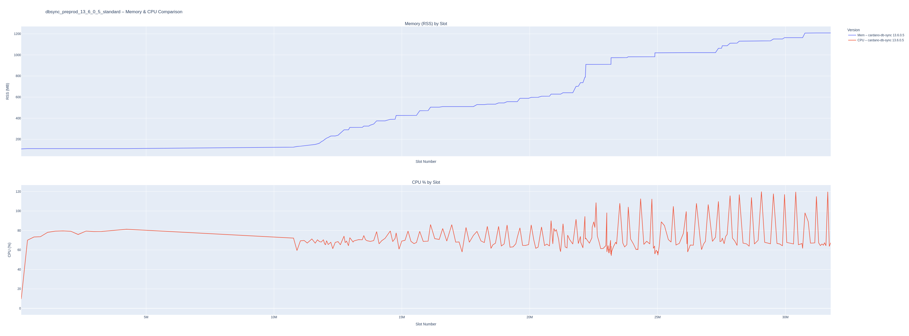
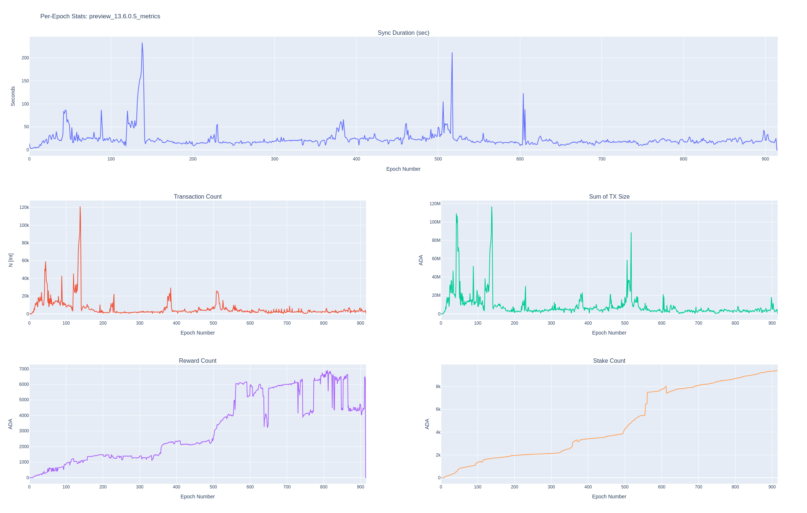

# Installation

## Requirements

```bash
- uv
```


## Manual Installation


```bash
uv venv

source .venv/bin/activate

uv pip install -r requirements.txt
```

## Make


🛠️ How it behaves:
- `make help`  
  → prints detailed help  
- `make install`  
  → installs everything  
  → immediately opens a new shell inside `.venv` automatically
- `make shell`  
  → jump into your virtualenv anytime (even manually)
- `make clean`  
  → wipes `.venv` completely
- `make activate`  
  → prints the manual activation command if you prefer manual control

**Important note:**  
- You need `bash` installed (should be fine on Linux/macOS).  
- `bash --rcfile` trick ensures **your normal shell stays untouched** after you `exit` — smooth experience!


## `make install`

### TL;DR

👉 **The venv *is activated***, but the prompt is not updated *because it's in a subprocess spawned by Make.**  
👉 **It’s working fine**.  


Normally, when you activate manually like:

```bash
source .venv/bin/activate
```
**Bash** updates your prompt (PS1) automatically to show `(.venv)`.

But in **Makefile**, you spawn a *subprocess* like `/bin/sh`, and **subshells** often don't update your PS1 (prompt) *unless you specifically start an interactive shell*.

To check if your `venv` is activated run:

```sh
$ which python3
$PWD/db-sync-monitoring/.venv/bin/python3

$ exit
make[3]: Leaving directory '$PWD/db-sync-monitoring'
```

# Explanation of what scripts do

Scripts in this repository monitor **CPU** and **RAM** usage using [`psutil`](https://psutil.readthedocs.io/), assuming the data is available

## 📊 RAM Metrics
| Metric | Description |
|:---|:---|
| `rss` | Resident Set Size: physical memory used (in RAM). |
| `vms` | Virtual Memory Size: total virtual memory used. |
| `uss` | Unique Set Size: memory unique to the process (not shared). |
| `pss` | Proportional Set Size: memory shared proportionally between processes. |
| `swap` | Amount of swap memory the process is using. |
| `shared` | Amount of memory shared with other processes. |

## 🖥️ CPU Metrics
| Metric | Description |
|:---|:---|
| `cpu_percent` | CPU usage percentage of the process. |
| `user_time` | Time spent in user mode (running user code). |
| `system_time` | Time spent in system mode (running kernel code). |
| `children_user` | Total user time of all child processes. |
| `children_system` | Total system time of all child processes. |
| `iowait` | Time spent waiting for I/O operations (disk/network). |
| `ctx_switches` | Number of context switches (voluntary + involuntary). |
| `interrupts` | Number of hardware interrupts the process received. |

---


for already running `cardano-db-sync` process so it is required that `cardano-node` and `cardano-db-sync` executables with proper 
config files are already present in the system.

Script for monitoring should be run right after `cardano-db-sync` is started. 
Results will be reported in the function of `slots` instead of elapsed time.


# `db-sync-process-monitor.py`

This scripts allows tracking stats for multiple `cardanodb-sync` versions and compare results between them.


## TL;DR

Start script so it will monitor `cardano-db-sync` and save stats to local `sqlite` database:

```sh
python3 db-sync-process-monitor.py --env preprod --db-sync-ver 13.6.0.5 --pg-dbname preprod_13.6.0.5_metrics
waiting for versions…
Slot 171760 | Sync Progress: 1.98% | CPU 3.9% | RSS 110.2578125MB
Slot 420580 | Sync Progress: 2.25% | CPU 69.9% | RSS 111.82421875MB
Slot 673880 | Sync Progress: 2.53% | CPU 72.8% | RSS 111.82421875MB
Slot 911700 | Sync Progress: 2.79% | CPU 71.0% | RSS 112.171875MB
```


Generally it is assumed that databases for `cardano-db-sync` will be named according to this format:

`{env}_{dbsync_version}_metrics`

Example: for `preprod` and version `13.6.0.5` of `cardano-db-sync` `pgpass-preprod` should contain the following database name:

`preprod_13.6.0.5_metrics`

if user follows this convention then only two params are required to pass to script when starting it:

```sh
python3 db-sync-process-monitor.py --env preprod --db-sync-ver 13.6.0.5
```

however script exposes additional flag for database name `--pg-dbname` so it is not a strict requirement and user can pass a different db name.
Correct database name and other elements of connection string are essential for establishing connection with `postgres` in order to get `slot` number
and sync progress as well as other stats for dfifferent scripts.

```bash
python3 db-sync-process-monitor.py
usage: db-sync-process-monitor.py [-h] --env ENV --db-sync-ver DB_SYNC_VER [--pg-host PG_HOST]
                                  [--pg-port PG_PORT] [--pg-user PG_USER] [--pg-dbname PG_DBNAME]
db-sync-process-monitor.py: error: the following arguments are required: --env, --db-sync-ver

```

When running for the first time for some version based on provided arguments script will add `db-sync version` for this run for all stats:

```python
    def get_db_sync_version(self) -> str:
        return f"cardano-db-sync {self.db_sync_ver} {self.env}"
```

and new database file will be created if it was not present before:

```
dbsync_preprod_stats_sqlite.db
```

This is `sqlite` database file with all the stats for - in this case - `preprod` environment.

When user wants to run different version of `cardano-db-sync` then this script will use this exact `sqlite` database
file and write stats for new version of `db-sync` so they can be later compared between each other. 

It is important to not delete `sqlite` database file for particular environments and create backups.
Those db files should be used for all sync and monitoring tests with different versions so they can be used for tracking changes
and comparing performance.


```sh
python3 db-sync-process-monitor.py --env preprod --db-sync-ver 13.6.0.5 --pg-dbname preprod_13.6.0.5_metrics
waiting for versions…
waiting for versions…
Slot 171760 | Sync Progress: 1.98% | CPU 3.9% | RSS 110.2578125MB
Slot 420580 | Sync Progress: 2.25% | CPU 69.9% | RSS 111.82421875MB
Slot 673880 | Sync Progress: 2.53% | CPU 72.8% | RSS 111.82421875MB
Slot 911700 | Sync Progress: 2.79% | CPU 71.0% | RSS 112.171875MB
Slot 1209457 | Sync Progress: 3.11% | CPU 77.8% | RSS 112.171875MB
Slot 1516195 | Sync Progress: 3.45% | CPU 79.7% | RSS 112.171875MB
Slot 1819453 | Sync Progress: 3.78% | CPU 78.5% | RSS 112.4296875MB
1. cardano-db-sync 13.6.0.5 preprod
choose (e.g. 1,2):
Slot 2084405 | Sync Progress: 4.07% | CPU 67.7% | RSS 112.171875MB
Slot 2341224 | Sync Progress: 4.35% | CPU 69.6% | RSS 112.609375MB
Slot 2646036 | Sync Progress: 4.68% | CPU 79.1% | RSS 112.9296875MB
Slot 2942722 | Sync Progress: 5.00% | CPU 79.7% | RSS 112.9296875MB
Slot 3231591 | Sync Progress: 5.32% | CPU 75.9% | RSS 112.9296875MB
Slot 3526130 | Sync Progress: 5.64% | CPU 78.6% | RSS 112.9296875MB
```

There will be reported available versions of `cardano-db-sync` for comparison:

```sh
1. cardano-db-sync 13.6.0.5 preprod
choose (e.g. 1,2):
```

In this case there is only one so let's press `1` and hit enter.
Web browser with graph will be opened and graph itslef saved to `plots` directory.

Graphs can be created with different tool like `regenerate-plots.py` so it is not neccessairy to do it during syncing stats.
Once `cardano-db-sync` reached 100% script can be shut down.


# `regenerate-plots.py`

This script is used to create graphs and comparisons based on `sqlite` database.

If user wants stats for just one particular version then just one number that symbolises that version should be chosen.

```
Available versions:
1. cardano-db-sync 13.6.0.5
Select versions to compare (comma-sep indices, e.g. 1,2): 1
```


```bash
$ python3 regenerate-plots.py 
usage: regenerate-plots.py [-h] --sqlite-db SQLITE_DB [--output-folder OUTPUT_FOLDER] --dbname DBNAME
regenerate-plots.py: error: the following arguments are required: --sqlite-db, --dbname

$ python3 regenerate-plots.py --sqlite-db dbsync_preprod_stats_sqlite.db --output-folder emergency --dbname preprod_13.6.0.5
Available versions:
1. cardano-db-sync 13.6.0.5
Select versions to compare (comma-sep indices, e.g. 1,2): 1
Saved comparison HTML to emergency/comparison_preprod_13.6.0.5_cardano-db-sync13.6.0.5.html


ls -l emergency/
drwxrwxr-x artur artur 4.0 KB Sat Apr 26 15:14:54 2025  ./                                                       --
drwxrwxr-x artur artur 4.0 KB Sat Apr 26 15:21:13 2025  ../                                                      --
.rw-rw-r-- artur artur 4.5 MB Sat Apr 26 15:14:54 2025  comparison_preprod_13.6.0.5_cardano-db-sync13.6.0.5.html --
```




# `create-db-sync-stats.py`

This script creates graphs based on `cardano-db-sync` postgres database for:
- sync duration
- Transaction Count
- Sum of TX Size
- Reward Count
- Stake Count
- List of tables and their sizes
- Whole database size


```bash
$ python3 create-db-sync-stats.py 
usage: create-db-sync-stats.py [-h] [--pg-host PG_HOST] [--pg-port PG_PORT] [--pg-user PG_USER] --pg-dbname PG_DBNAME [--outdir OUTDIR]
create-db-sync-stats.py: error: the following arguments are required: --pg-dbname


python3 create-db-sync-stats.py --pg-dbname preprod_13.6.0.5_metrics

Saved plot to plots/preprod_13.6.0.5_metrics_epoch_stats_20250426_152113.html
Wrote size report to stats/preprod_13.6.0.5_metrics_db_size_report_20250426_152113.txt

$ ll plots/
drwxrwxr-x artur artur 4.0 KB Sat Apr 26 15:21:13 2025  ./                                                        --
drwxrwxr-x artur artur 4.0 KB Sat Apr 26 15:23:30 2025  ../                                                       --
.rw-rw-r-- artur artur 4.5 MB Sat Apr 26 15:21:13 2025  preprod_13.6.0.5_metrics_epoch_stats_20250426_152113.html --

$ ll stats/
drwxrwxr-x artur artur 4.0 KB Sat Apr 26 15:21:13 2025  ./                                                          --
drwxrwxr-x artur artur 4.0 KB Sat Apr 26 15:23:30 2025  ../                                                         --
.rw-rw-r-- artur artur 4.0 KB Sat Apr 26 15:21:13 2025  preprod_13.6.0.5_metrics_db_size_report_20250426_152113.txt --
```





```sh
Database: preprod_13.6.0.5_metrics
Total size: 1147 MB

Table sizes:
  public.block                             → 252 MB
  public.tx_out                            → 241 MB
  public.tx_metadata                       → 170 MB
  public.tx                                → 96 MB
  public.datum                             → 89 MB
  public.ma_tx_out                         → 83 MB
  public.tx_in                             → 59 MB
  public.script                            → 38 MB
  public.multi_asset                       → 32 MB
  public.ma_tx_mint                        → 20 MB
  public.redeemer                          → 17 MB
  public.redeemer_data                     → 8584 kB
  public.collateral_tx_in                  → 6840 kB
  ...
```


# SQLite

### Removing records

To remove every record associated with a specific version (e.g. `cardano-db-sync 13.6.0.5 preprod`) from all three tables in your SQLite database, you can run the following `DELETE` statements—either via the `sqlite3` CLI or in your Python code. These will safely remove only rows matching that exact `version` string:

```sql
-- Open your SQLite DB
$ sqlite3 cardano_full_monitor.db

-- Delete from memory_metrics
DELETE FROM memory_metrics
 WHERE version = 'cardano-db-sync 13.6.0.5 preprod';

-- Delete from cpu_metrics
DELETE FROM cpu_metrics
 WHERE version = 'cardano-db-sync 13.6.0.5 preprod';

-- Delete from db_sync_version
DELETE FROM db_sync_version
 WHERE version = 'cardano-db-sync 13.6.0.5 preprod';

-- (Optionally, verify no rows remain)
SELECT COUNT(*) FROM memory_metrics  WHERE version = 'cardano-db-sync 13.6.0.5 preprod';
SELECT COUNT(*) FROM cpu_metrics     WHERE version = 'cardano-db-sync 13.6.0.5 preprod';
SELECT COUNT(*) FROM db_sync_version WHERE version = 'cardano-db-sync 13.6.0.5 preprod';

-- Exit
.quit
```

---

### In Python

If you prefer to do this within your monitoring script (using the `sqlite3` module), you could add a helper like:

```python
import sqlite3

def purge_version(db_file: str, version: str):
    with sqlite3.connect(db_file) as conn:
        c = conn.cursor()
        for tbl in ('memory_metrics', 'cpu_metrics', 'db_sync_version'):
            c.execute(f"DELETE FROM {tbl} WHERE version = ?", (version,))
        conn.commit()
```

Then call:

```python
purge_version('cardano_full_monitor.db', 'cardano-db-sync 13.6.0.5 preprod')
```

This will atomically delete all rows for that version across the three tables.


## Updating stats for wrong `db-sync` version:

You can do this with a simple `UPDATE` statement in SQLite. For each table that has a `version` column, run:

```sql
UPDATE memory_metrics
   SET version = 'cardano-db-sync 13.6.0.5 preprod'
 WHERE version = 'cardano-db-sync 13.6.0.5';

UPDATE cpu_metrics
   SET version = 'cardano-db-sync 13.6.0.5 preprod'
 WHERE version = 'cardano-db-sync 13.6.0.5';

UPDATE db_sync_version
   SET version = 'cardano-db-sync 13.6.0.5 preprod'
 WHERE version = 'cardano-db-sync 13.6.0.5';
```

You can execute these in the `sqlite3` CLI or via your Python script:

```bash
$ sqlite3 cardano_full_monitor.db <<EOF
UPDATE memory_metrics    SET version = 'cardano-db-sync 13.6.0.5 preprod' WHERE version = 'cardano-db-sync 13.6.0.5';
UPDATE cpu_metrics       SET version = 'cardano-db-sync 13.6.0.5 preprod' WHERE version = 'cardano-db-sync 13.6.0.5';
UPDATE db_sync_version   SET version = 'cardano-db-sync 13.6.0.5 preprod' WHERE version = 'cardano-db-sync 13.6.0.5';
EOF
```

That will rename every matching row in all three tables.

